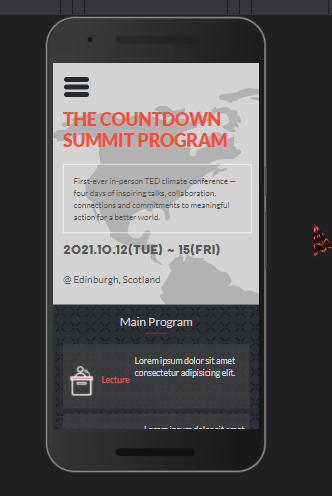
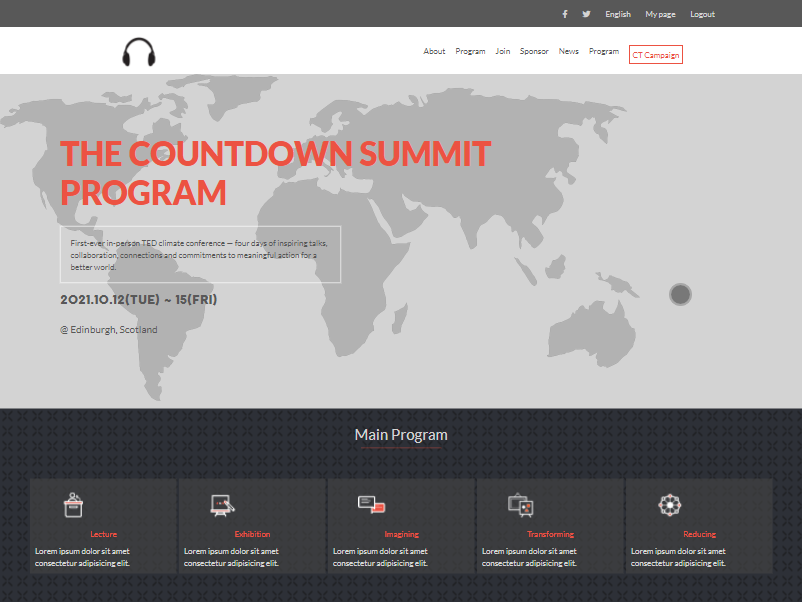

# Capstone Project - Conference page

> An event page for an upcoming conference

## Built With

- HTML
- CSS
- JavaScript

## See it in action

[Live Demo Link](https://cwaku.github.io/capstone-project/)

## Getting Started

To get a local copy up and running follow these simple example steps.

### Prerequisites

### Setup

All you have to do is clone and you are good to go

## Author

- GitHub: [@cwaku](https://github.com/cwaku)
- LinkedIn: [Ricky Mormor](www.linkedin.com/in/ricky-mormor)

## 🤝 Contributing

Contributions, issues, and feature requests are welcome!

Feel free to check the [issues page](https://github.com/cwaku/capstone-project/issues).

## Show your support

Give a ⭐️ if you like this project!

## Acknowledgments

- Original design idea by
[Cindy Shin in Behance](https://www.behance.net/adagio07)

## 📝 License

This project is [MIT](./MIT.md) licensed.
